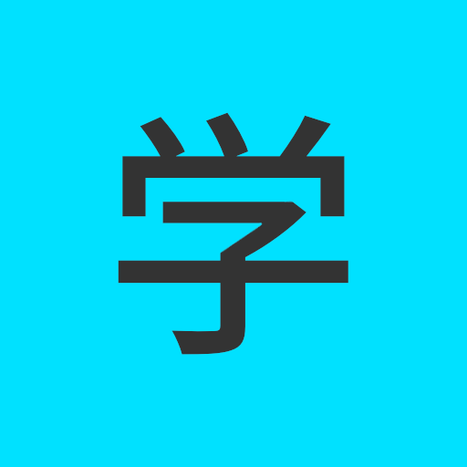
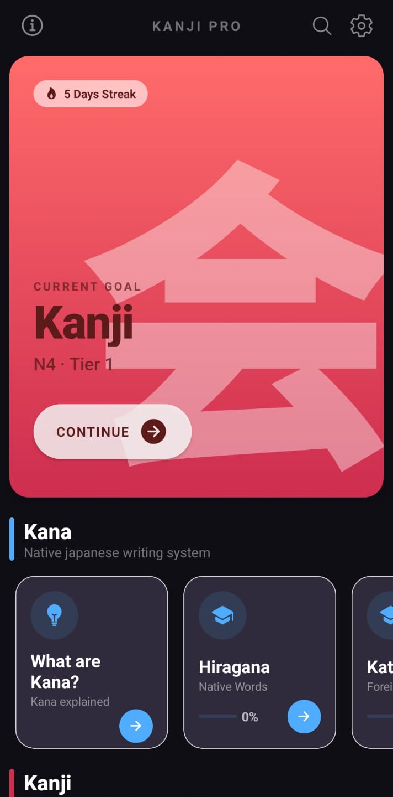
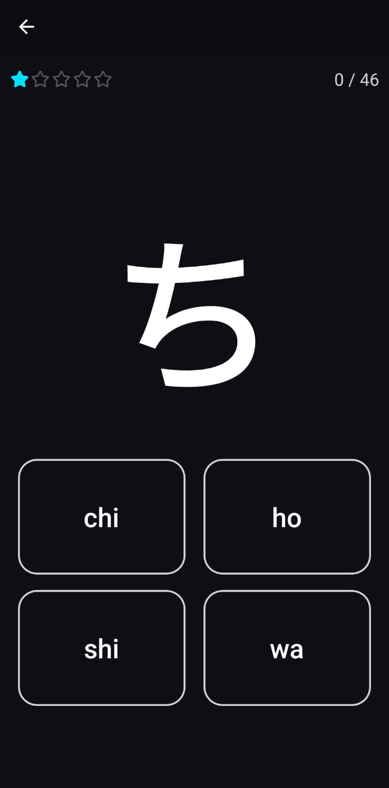
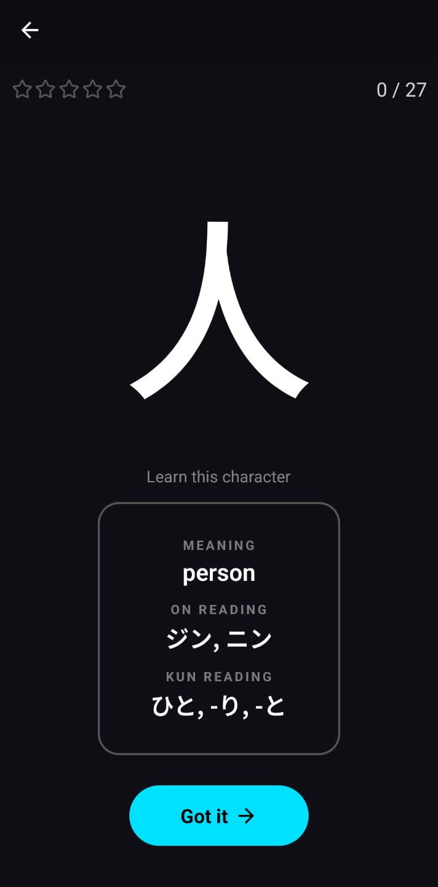
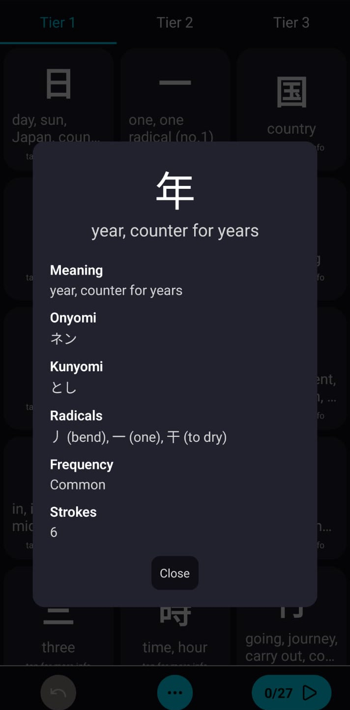
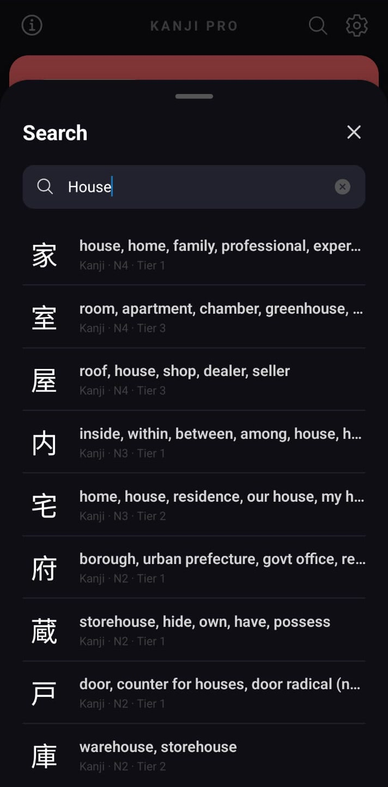
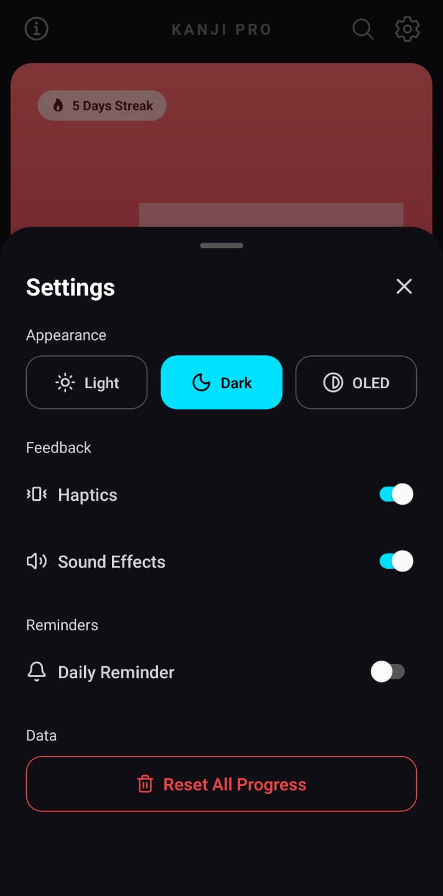

<div align="center">



# Kanji Pro

**Learn Japanese kana, kanji, and radicals.**

A clean, offline-friendly Japanese study app built with Expo and React Native.
Drill hiragana and katakana, work through kanji from N5 to N1, and master the
radicals that make them up, with a spaced, star-based mastery system.

</div>

---

## 📸 Screenshots

<div align="center">

| Home | Quiz | Learning Mode |
| :--: | :--: | :--: |
|  |  |  |

| Kanji Info | Search | Settings |
| :--: | :--: | :--: |
|  |  |  |

</div>

---

## Features

- **Full kana coverage**: Hiragana and katakana, basic sets plus variants and combinations.
- **Kanji N5 → N1**: 2,000+ kanji with meanings, on'yomi/kun'yomi readings, and the radicals each one is built from.
- **Radicals**: learn the building blocks and see them annotated inside every kanji.
- **Star-based mastery**: each character earns stars as you get it right; a configurable mastery level (1–15 stars) decides when it counts as "learned."
- **Smart question pool**: unmastered items are prioritised, mastered ones return occasionally for review, and a wrong answer knocks a character back into rotation.
- **Learning Mode**: brand-new characters (and any knocked back to zero stars) reveal their answer first, so you learn before you're tested. You can toggle it on/off in Quiz Settings.
- **Two input modes**: multiple-choice buttons or a built-in QWERTY keyboard that accepts romaji for kana readings.
- **Multiple question types for kanji**: quiz on meanings, on/kun-readings, or a mix.
- **Quality-of-life touches**: haptics, sound effects, light/dark/OLED themes, streak tracking, daily reminder, and search across the whole database.

---

## Tech Stack

- [Expo](https://expo.dev/) (~54) & [Expo Router](https://docs.expo.dev/router/introduction/) (file-based routing)
- [React Native](https://reactnative.dev/) 0.81 · React 19 · New Architecture enabled
- [React Native Reanimated](https://docs.swmansion.com/react-native-reanimated/) for animations
- [AsyncStorage](https://react-native-async-storage.github.io/async-storage/) for offline progress persistence
- [lucide-react-native](https://lucide.dev/) icons
- Dictionary data from **KANJIDIC2** and **KRADFILE-U**

---

## Getting Started

**Prerequisites:** [Node.js](https://nodejs.org/) (LTS) and the Expo tooling.

```bash
# Install dependencies
npm install

# Start the dev server
npm start
```

Then press `a` for Android, `i` for iOS, or `w` for the web build — or scan the QR code with the Expo Go app.

### Building a release

Build scripts live in `scripts/` and are wired into npm:

```bash
npm run build:debug   # debug APK
npm run build:dev     # dev client
npm run build:prod    # production APK
```

---

## Data & Licence

Kanji and radical data is derived from the **KANJIDIC2** and **KRADFILE-U**
dictionary files, property of the [Electronic Dictionary Research and Development
Group (EDRDG)](https://www.edrdg.org/), and used under the **Creative Commons
Attribution-ShareAlike 4.0** licence. See the
[EDRDG licence](https://www.edrdg.org/edrdg/licence.html) for details.

---

## Support

Kanji Pro is a solo passion project.

There's no way to support the project financially right now. If enough people end up using it, I might add one in the future.

For now, a star on the repository is the best way to support the project. Thanks!

---

## Licence

Application code is released under the MIT Licence — see [`LICENSE`](./LICENSE).
Dictionary data retains its original CC BY-SA 4.0 licence as noted above.

## About

I started building Kanji Pro because I wanted to learn kanji myself, but I couldn't find an app that matched what I was looking for.

Most apps felt overly complex or cluttered with features I didn't need. I wanted something simple, clean, and focused on learning kanji without unnecessary distractions. That idea became the foundation for Kanji Pro.

This is also my first app and my first larger programming project, so if you have any feedback, suggestions, or find a bug, I'd love to hear from you. Even if you just give the app a try, I really appreciate it.